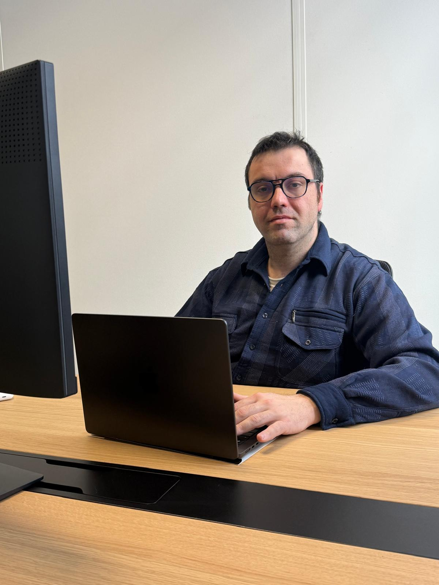

# Tommy JOUHANS — Web & Mobile Web Developer

## <h1 align="center">Hi 👋, I'm Tommy Jouhans</h1>
<h3 align="center">
I'm a web and mobile web development student retraining for a new career, I'm passionate about learning to code, cybersecurity, and programming best practices. Currently studying at Holberton School Dijon, I'm building projects to explore different technologies and strengthen my skills.
</h3>

📍 Dijon, France 🇫🇷 | 🌍 Open to full-stack & backend opportunities

## 🚀 About Me

Passionate about software engineering and clean architecture,  
I’m currently training as a Full-Stack Developer with a strong foundation in low-level programming (C) and backend development.

I enjoy understanding how things work under the hood — from memory management and system calls to REST APIs and dynamic front-end interfaces.

My goal: **build robust, scalable and well-structured web applications.**

---

## 🔭 I’m currently working on

**HBNB – Full-Stack Airbnb Clone**  

**-> [holbertonschool-hbnb](https://github.com/Tommy-JOUHANS/holbertonschool-hbnb)**

• CLI application → REST API → Web interface  
• Object-Oriented Programming  
• Storage engines (file & database)  
• MVC architecture  
• Frontend/Backend integration  

---

## 🌱 I’m currently learning

• API development  
• SQL & database design  
• Advanced backend architecture  
• Front-end frameworks (React / Vue ecosystem)

---

## 👯 I’m looking to collaborate on

• Full-Stack Web Applications  
• Backend systems in Python or Node.js  
• Open-source web or system projects  

---

## 🤝 I’m looking for help with

• Code optimization & performance  
• Clean architecture patterns  
• Production-ready backend structuring  

---

## 💬 Ask me about

• C programming & memory management  
• Building a Unix shell  
• Recreating printf from scratch  
• Git workflow & collaboration  
• Structuring full-stack projects  

---

## Technical Skills

| **💻 Languages** | **⚙️ Backend** | **🎨 Frontend** | **🧰 Tools**
|:-------- |:--------:|:--------:| --------:| 
| C           | Python    | HTML    | Git GitHub  |
| JavaScript  | REST APIs | CSS     |  PyCharm  |
| Python | File storage systems | JavaScript | Visual Studio Code |
| HTML5/CSS3  | SQL (learning)|      | Postman |

---

# Featured Projects

## holbertonschool-hbnb — Airbnb Clone

**-> [holbertonschool-hbnb](https://github.com/Tommy-JOUHANS/holbertonschool-hbnb)**

### Hook

A simplified, full-stack replica of the Airbnb platform, developed progressively to master the architecture of a complete web application.

### Description

This project involves developing a functional clone of Airbnb, starting with a command-line version and culminating in a web application with a user interface.

It covers data model management (users, listings, bookings), data persistence (JSON files/database), and the creation of a dynamic web interface.

The project puts into practice:

- Object-oriented programming
- Database management
- Back-end development
- Front-end integration
- MVC architecture

### Objectives

- Understand the architecture of a complete web application
- Implement a storage engine (file and/or database)
- Develop a REST API
- Build a dynamic interface
- Apply best practices for project structuring

---

## holbertonschool-printf — Custom printf in C

**-> [holbertonschool-printf](https://github.com/Tommy-JOUHANS/holbertonschool-printf)**

### Hook

Custom implementation of the printf function in C, reproducing its standard behavior.

### Description

This project involves recreating the printf function from the standard C library (stdio.h).
It handles various format specifiers such as:

- %c (character)

- %s (string)
- %d / %i (integers)
- %u (unsigned integer)
- %x / %X (hexadecimal)
- %p (pointer)
- %% (%) symbol

The project involves:

- Pointer manipulation
- Variable argument handling (stdarg.h)
- String parsing
- Memory management
- Code modularization

### Objectives

- Understand the inner workings of standard functions
- Master variadic arguments
- Improve memory management in C
- Structure a collaborative project with multiple files and branches

---

##  holbertonschool-simple-shell — Mini Unix Shell

 **-> [holbertonschool-simple-shell](https://github.com/Thorgalix/holbertonschool-simple_shell)**

### Hook:

Development of a minimalist Unix shell interpreter in C.

### Description

This project consists of Create a simple shell capable of executing Unix commands such as:

- ls
- pwd
- echo Hello
- ./program

Main features:

- Reading user commands
- Creating processes with fork()
- Execution with execve()
- Managing environment variables
- Error handling
- Implementing some built-in commands
- It simulates the behavior of a classic Unix terminal.

### Objectives

- Understand process management under Linux
- Manipulate system calls
- Manage environment variables
- Implement a command interpreter
- Apply strict coding standards

# Tommy-JOUHANS

---

### Other repositories available

Here are other projects on my GitHub account:

- holbertonschool-france-certificates-ibm — IBM certifications related to the Holberton program.

*-> [holbertonschool-france-certificates-ibm](https://github.com/Tommy-JOUHANS/holbertonschool-france-certificates-ibm)*

- holbertonschool-higher_level_programming — Advanced Python concepts.

*-> [holbertonschool-higher_level_programming](https://github.com/Tommy-JOUHANS/holbertonschool-higher_level_programming)*

- holbertonschool-low_level_programming — Low-level C projects.

*-> [holbertonschool-low_level_programming](https://github.com/Tommy-JOUHANS/holbertonschool-low_level_programming)*

- holbertonschool-sorting_algorithms — Sorting algorithms in C.

*-> [holbertonschool-sorting_algorithms](https://github.com/Tommy-JOUHANS/holbertonschool-sorting_algorithms)*

- holbertonschool-shell — Shell basic project.

*-> [holbertonschool-shell](https://github.com/Tommy-JOUHANS/holbertonschool-shell)* 
  

---

## 📫 How to reach me

📧 tommy.jouhans@outlook.com  
💼 LinkedIn: https://www.linkedin.com/in/tommy-jouhans-pro  

---

⚡ Fun fact  
I transitioned into tech and discovered that debugging is basically detective work — and I love solving puzzles.